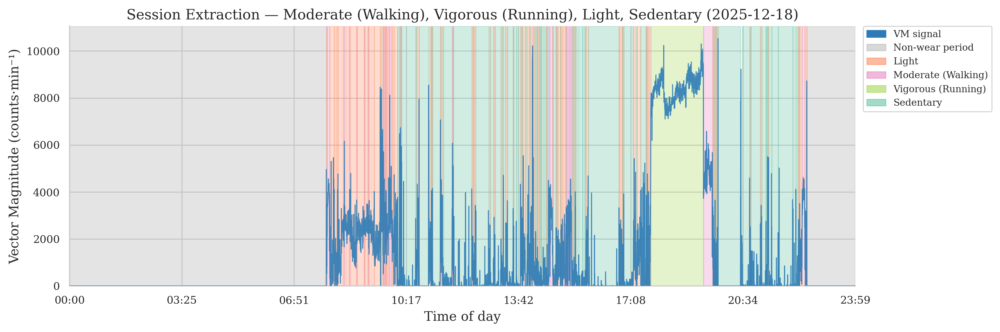

# Series00-Git-AlexisLag-student

## Introduction

This repository is a learn-by-doing exercise on the basics of Git and GitHub,
created for the course _Python, R and Git for data analysis_ (IEAP Master's).

I already used Git during a class last year, so I am familiar with the general
idea of repositories, commits and branches. However, my practice so far has
stayed fairly basic, and I have not used branching or collaborative workflows
much beyond the essentials.

I am looking forward to strengthening these skills and using Git properly as
part of a real data analysis pipeline, rather than as an afterthought.

## An image to brighten this repository

## Why I want to learn Python, R and Git

Last year I lost a script that worked. I had it, then I changed it, and then
I did not have it anymore, no history, no way back. That is the kind of
mistake you only need to make once.

So my motivation here is not really about learning commands. It is about
never again being in a position where a single careless save erases work I
cannot reproduce. Git is the safety net; Python and R are what I actually
want to build on top of it.

By the end of this course I want version control to be a reflex rather than
something I remember to do afterwards.

## An image from my own machine

## What I learned

The main concept is that a repository exists twice (locally on my machine and
remotely on GitHub) and that Git keeps the two in sync while recording the
full history of every change.

Branches let me work on something without touching the stable `main` version.
A commit is a snapshot with a message explaining it; pushing sends those
commits to GitHub so they exist somewhere other than my laptop.

The operations I used were: clone, create a branch, commit, publish the branch,
and push. I also learned the Markdown syntax for images, and the difference
between an absolute URL pointing to the web and a relative path pointing inside
my own repository.

It took me about X to complete this assignment.
